# BuyMeCoffee

- [demo](https://www.youtube.com/shorts/TWmtCKO6BIg)
- Designed and implemented an end-to-end [checkout](https://app.bloomingrice.com/menu_order/c5b52e3b-3dee-488d-bebd-f9e216547d68) workflow, including order creation, payment initiation, idempotent processing, transactional consistency, webhook signature verification, and asynchronous payment confirmation
- Designed and implemented production and staging traffic routing architecture using Cloudflare DNS and Traefik
- Improved overall security posture by separating public and private network boundaries, implementing VPC peering, configuring firewall / Traefik rules, and applying Cloudflare anti-bot protection
- Implemented a centralized [logging](img/logscreen.png) pipeline, notification(firebase), [SliderCaptcha](https://app.bloomingrice.com/login), i18n and timezone

## Security Testing & Hardening

### 🔍 Penetration Testing
**Burp Suite - IDOR (Insecure Direct Object Reference) Testing**
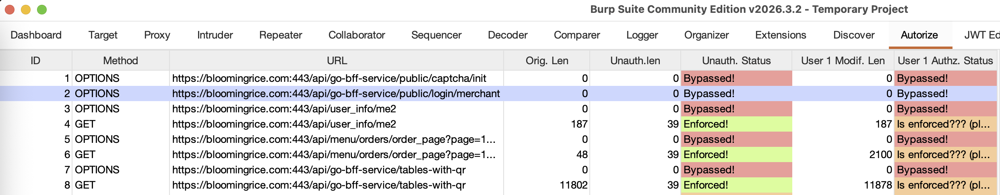
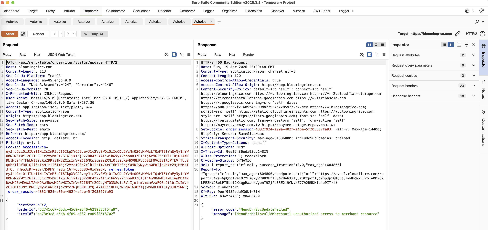

### 🛡️ Web Security Headers
**HSTS (HTTP Strict Transport Security) Implementation**
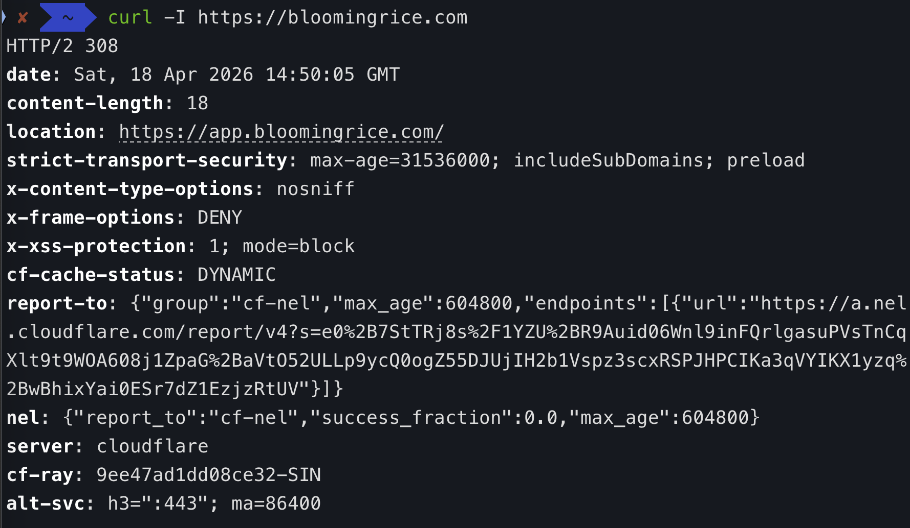

### 🔒 SSL/TLS Security
**SSL Labs Security Assessment**
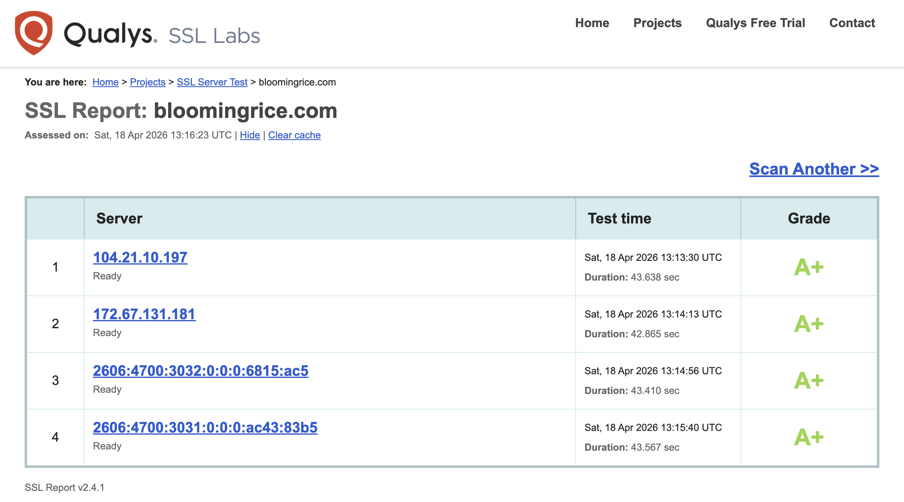

### 🚨 Automated Security Scanning
**OWASP ZAP Security Analysis**
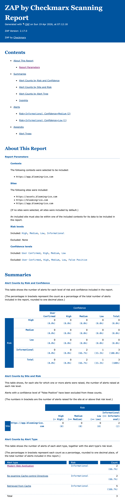

### 🔍 Network Vulnerability Scanning
**OpenVAS (Greenbone Vulnerability Management)**
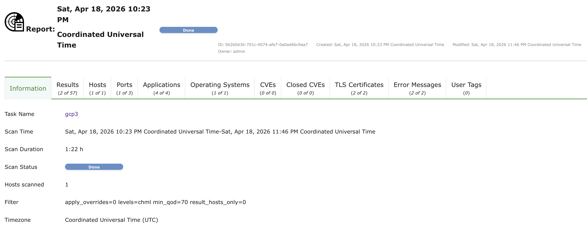
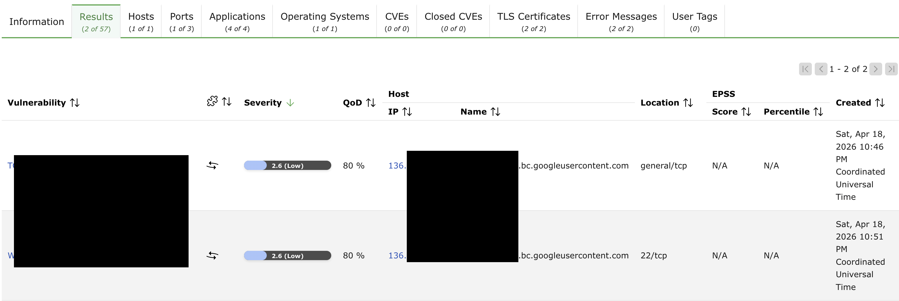
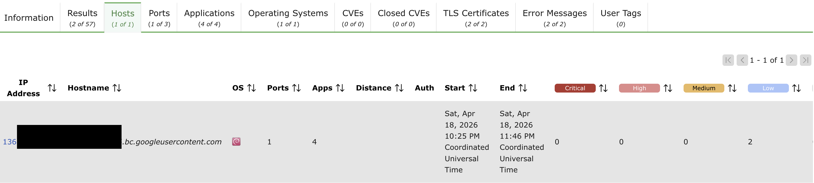
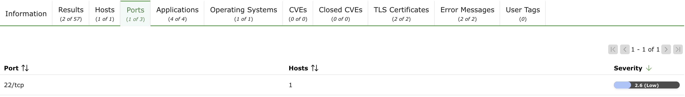
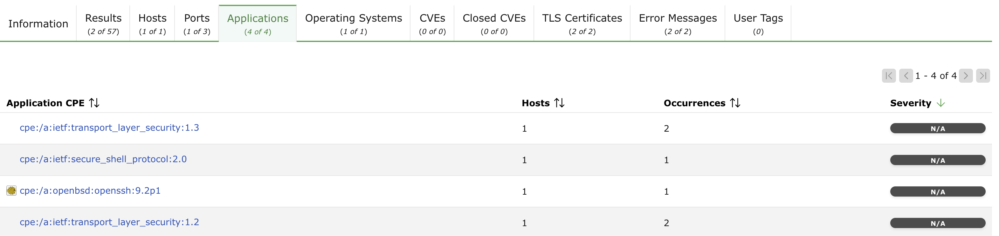
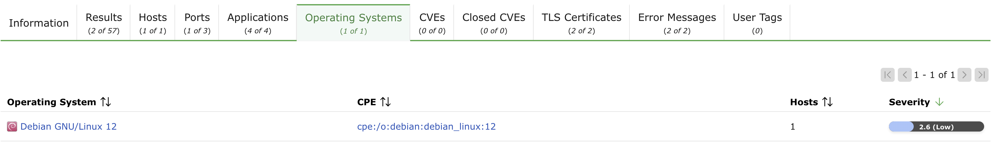
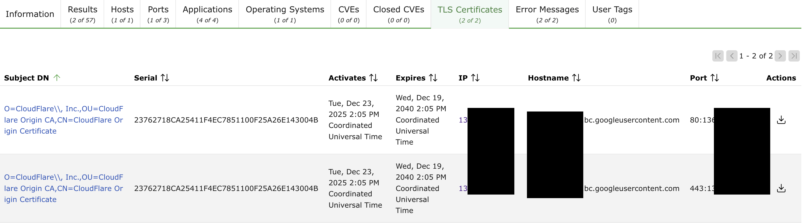
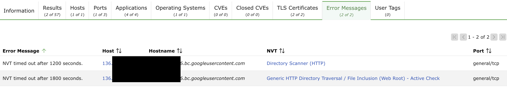
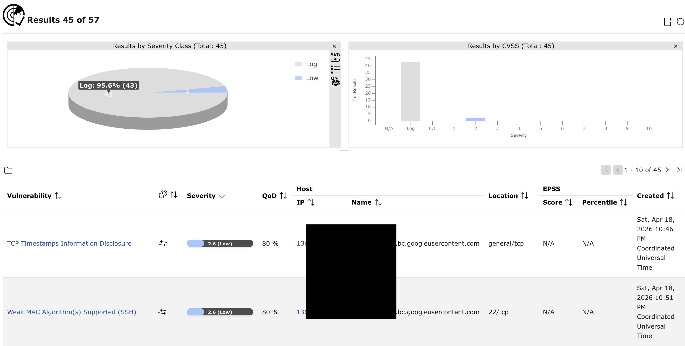
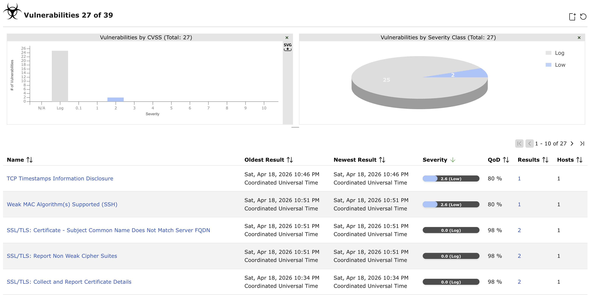

### 🐳 Container & Infrastructure Security
**Trivy Vulnerability Scanner**
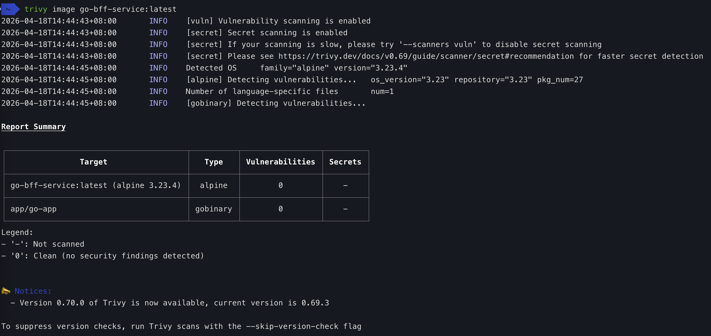

### Observability
- By correlating logs and traces with the same Trace ID, we can navigate from a log entry directly to the full trace, inspect the request execution path, and identify performance bottlenecks across services.
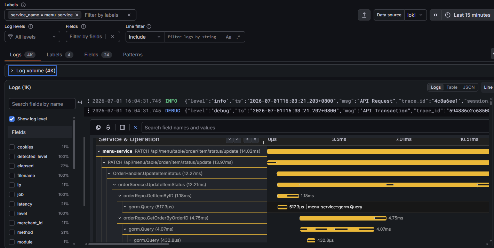
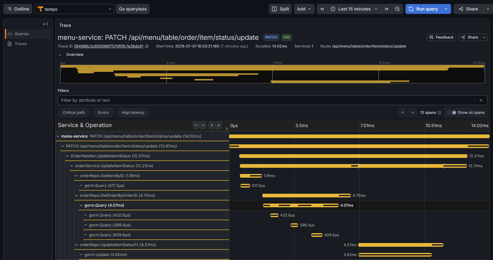
- A client request passing through the BFF service to the Blog service, completing successfully with a 200 OK response in 13.17 ms.
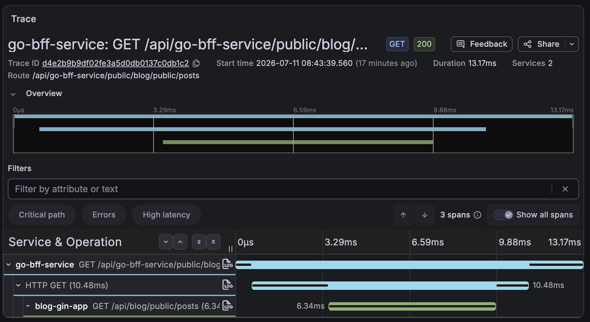
- Similar idea with a more complex scenario.
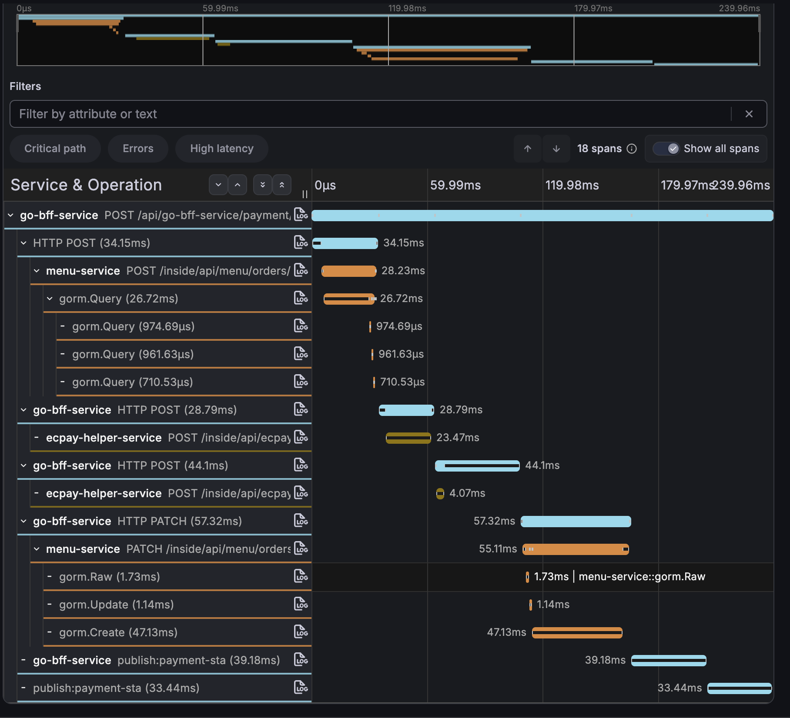
- Dashboard correlates metrics, traces, and logs, allowing us to follow a request across multiple services and inspect the related logs using the same Trace ID.
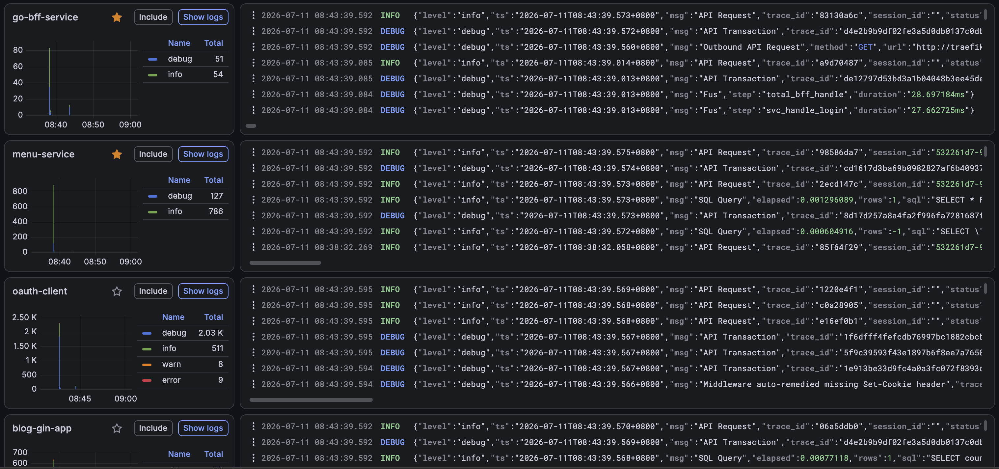
- Querying OpenTelemetry span metrics to show the top API calls by service and endpoint traffic rate.
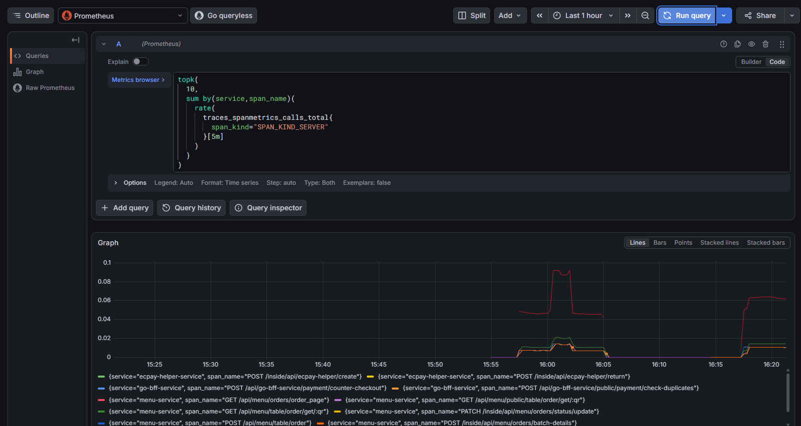
- Tempo is querying distributed traces to show API request rates, latency (p90), and service relationships.
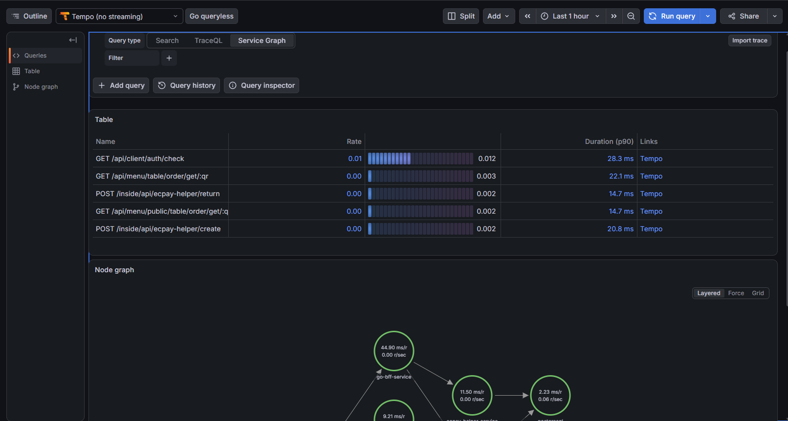
- Grafana SRE Service Detail dashboard shows a service's traffic, API performance, and latency metrics using Prometheus and Tempo data.
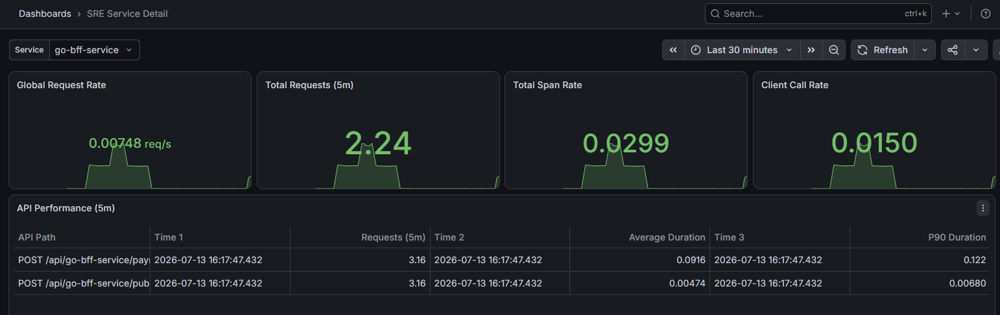
